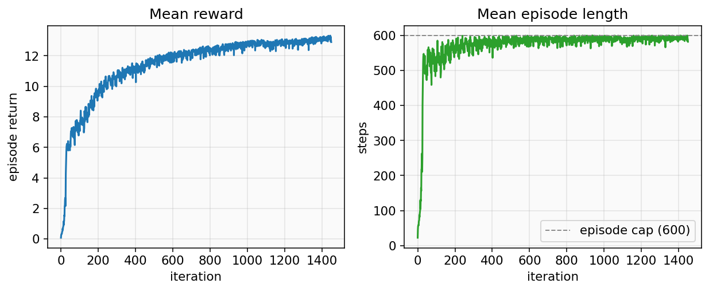
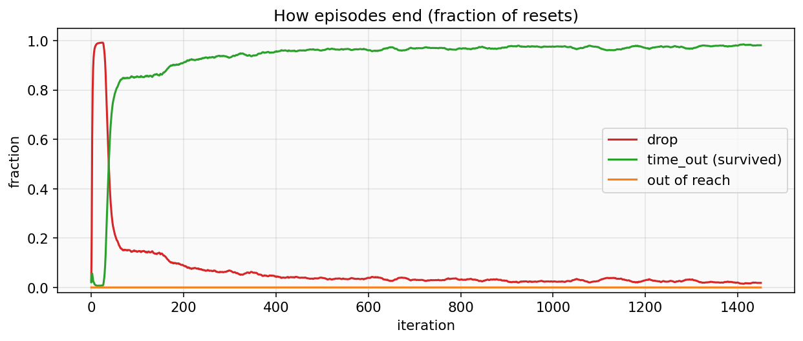
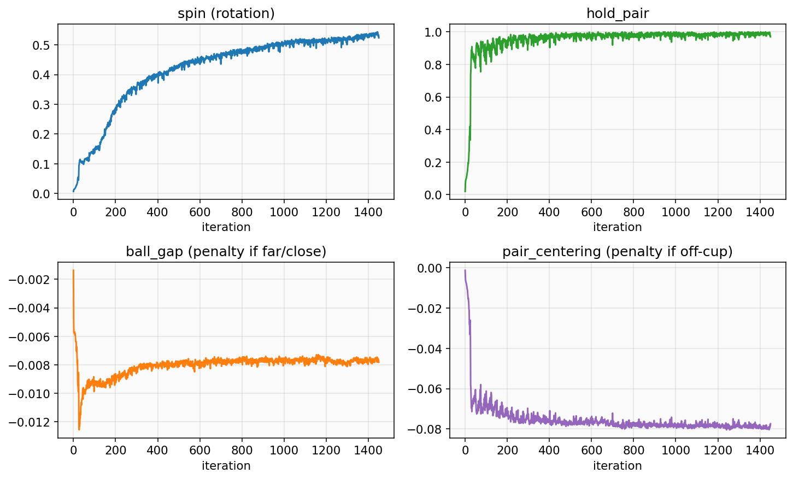
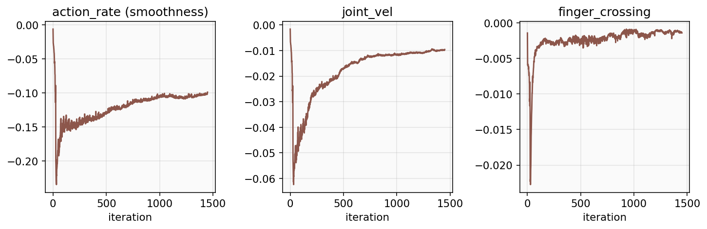
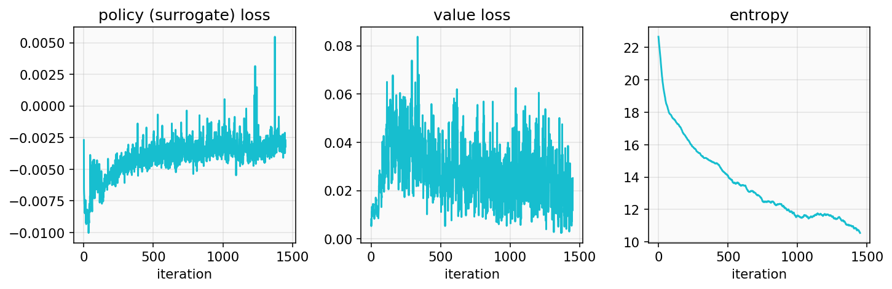

# 保健球训练：这些曲线在说什么

数据来自这次长训：`PAN-BaodingRotate-Apex-Left-v0`，4096 个并行环境，计划 3000 iteration。图截到 **iteration 1450** 左右（大约一半），checkpoint 在 `logs/rsl_rl/pan_baoding_rotate/2026-09-05_16-14-27/`。

浏览器里看同一份数：

```bash
source ./env.sh
tensorboard --logdir logs/rsl_rl/pan_baoding_rotate/2026-09-05_16-14-27 --port 6006
```

打开 http://localhost:6006 。下面五张图就是那里面几条关键曲线的截图，按「先看会不会掉、再看有没有在转」的顺序读。

---

## 1. 总奖励和活多久



| 曲线 | 含义 | 现在大概 |
|---|---|---|
| **Mean reward** | 一个 episode 里所有奖励加起来的平均。上升 = 整体在变好，但看不出是「托住了」还是「转起来了」。 | ~12.9 |
| **Mean episode length** | 一次尝试平均走多少步。上限 **600 步 = 10 秒**（虚线）。碰到上限是活满了，不是卡死。 | ~580–590 |

前 100 个 iteration 两条都陡升：手从「球一放上去就飞」学会了把球留在掌心里。100 以后长度贴着上限抖，奖励还在慢爬——多出来的分主要来自转，不是再防掉。

---

## 2. episode 为什么结束



每次重置只能算一种结束原因，三条加起来约等于 1。

| 曲线 | 含义 | 好不好 |
|---|---|---|
| **drop**（红） | 有一个球离开掌窝（掉下去或飞太远）。 | 越低越好。现在 **~2%**。开头那一针接近 1.0，是策略乱抓把球弹出去，不是环境又坏了。 |
| **time_out**（绿） | 活满 10 秒被时间截断。保健球任务里这就是「没掉」。 | 现在 **~98%**。 |
| **out of reach**（橙） | 球跑到离手 45 cm 以外。几乎是掉到地上还没被 drop 判到的备用闸。 | 一直是 0，正常。 |

读法：红降、绿升，说明先学会了生存。红线如果再翘起来，才需要回头查物理或奖励。

---

## 3. 任务本身：转、托、间距、对中



`Episode_Reward/*` 是该项**加权之后、再按满 episode 长度平均**的值。正的是奖励，负的是惩罚（越接近 0 越好）。

| 曲线 | 权重 | 含义 |
|---|---|---|
| **spin** | +8 | 两球连线按指令方向转过的角度。任务真正要学的东西。还在往上爬（~0.52），没有封顶。 |
| **hold_pair** | +1 | 两球都还在掌窝里则为 1。很快到 ~0.97，和「几乎不再掉」是同一件事。 |
| **ball_gap** | −4 | 球心距偏离「刚好贴上」（2×半径 + 3 mm）。两球散开或重叠都罚。稳定在很小的负数，间距基本对。 |
| **pair_centering** | −3 | 两球中点偏离掌窝中心。转的时候不可能永远待在正中，所以会比 gap 更负一点；现在约 −0.08，能接受。 |

关系：`hold` 饱和之后，**只看 spin 就够判断还有没有在学**。spin 若平台很久而奖励也不动，才是该停训或改奖励的时候。1450 步时它还在涨，继续跑完 3000 是合理的。

---

## 4. 动作约束：别抖、别交叉



这些不教「怎么转球」，只挡坏习惯。都是负数，数量级小是正常的。

| 曲线 | 权重 | 含义 |
|---|---|---|
| **action_rate** | −0.01 | 相邻两步动作差。太大 = 手指抽筋。现在约 −0.10，有一点为了转而付出的抖动，没有爆。 |
| **joint_vel** | −2.5×10⁻⁵ | 关节速度。权重极小，几乎只是轻拍。 |
| **finger_crossing** | −20 | 手指在掌面横向交叉。权重很大，所以曲线贴着 0（约 −0.001）说明几乎没交叉。 |

如果 `finger_crossing` 突然掉到 −1 以下，是手指绞在一起，真机上会打架。

---

## 5. PPO 内部（次要）



| 曲线 | 含义 | 现在怎么看 |
|---|---|---|
| **surrogate loss** | 策略更新的目标。有起伏正常，不要求单调下降。 | 稳定即可。 |
| **value loss** | critic 估价值准不准。这次 critic 能看到仿真里的球真值，所以这条只反映「估得稳不稳」。 | 没有发散就行。 |
| **entropy** | 策略还敢不敢试新动作。太低 = 过早定型。 | 还在 ~10.5，没有塌掉。 |

这三张**不要**用来判断球转得好不好，那是上面 spin / drop 的事。

---

## 一张表看当前状态

| 问题 | 看哪条 | 1450 iter 时的答案 |
|---|---|---|
| 环境还坏吗（球一放就飞）？ | episode 长度、drop | 不是。长度贴 600，drop ~2%。 |
| 会托住吗？ | hold_pair、time_out | 会。~98% 活满 10 秒。 |
| 会转吗？ | spin | 会，而且还在变好，没到平台。 |
| 能上真机了吗？ | 有 checkpoint + 掌面标定 | 权重已有（`model_1300.pt` 等），标定在 `configs/palm_calib.json`。要导出 ONNX 才能在手上跑。 |

导出等训完也可以，想现在就试：

```bash
source ./env.sh
python scripts/export_onnx.py --task PAN-BaodingRotate-Apex-Left-v0 \
  --checkpoint logs/rsl_rl/pan_baoding_rotate/2026-09-05_16-14-27/model_1300.pt
```

真机（标定好、C920 为 `--camera 2`）：

```bash
source env_real.sh
python -m real.policy_runner --onnx <刚导出的 policy.onnx> \
  --camera 2 --calib configs/palm_calib.json --spin +1 --show
```
