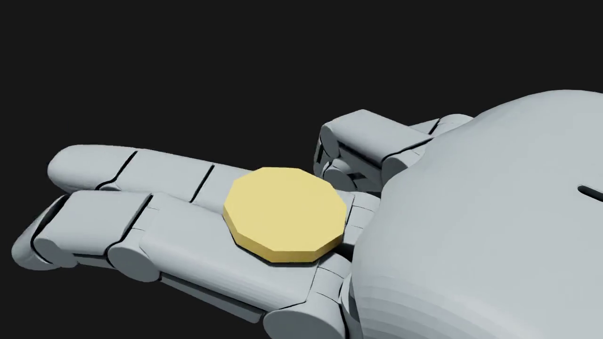
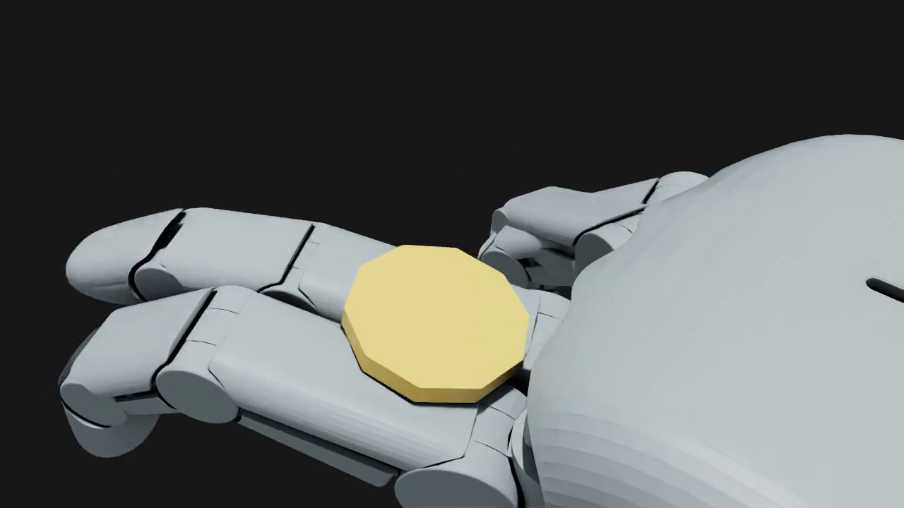
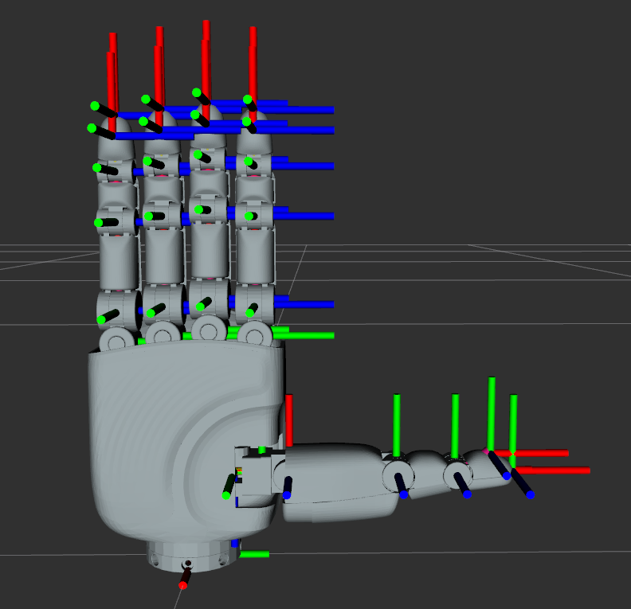
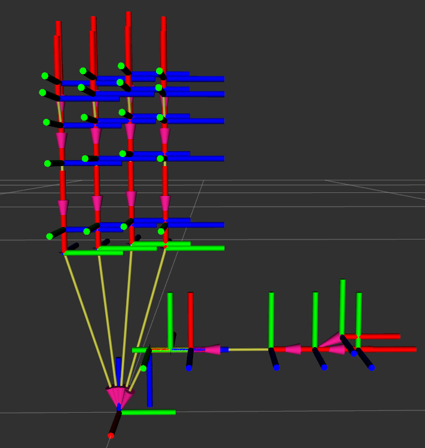
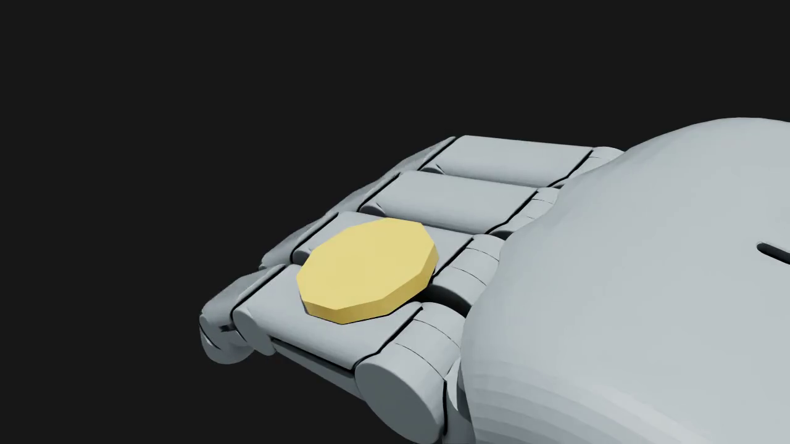
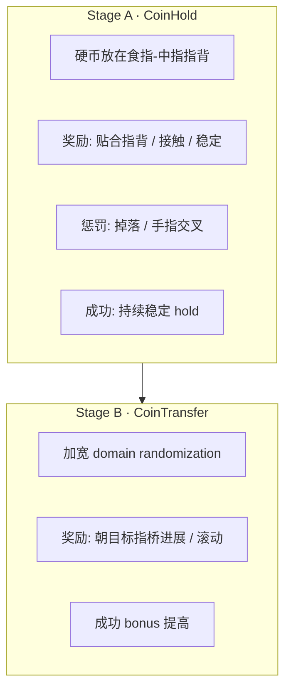
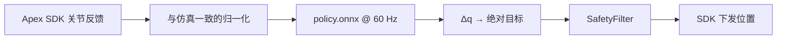

# PΛN Dexterous Lab 使用教程

面向 **Apex Hand 指背滚币（Knuckle Roll）** 的 Isaac Lab + RSL-RL 训练框架：从环境搭建、资产转换、分阶段训练，到策略回放 / ONNX 导出与 Sim2Real 注意事项。

---

## 目录

1. [项目概览](#1-项目概览)
2. [环境与依赖](#2-环境与依赖)
3. [仓库结构](#3-仓库结构)
4. [资产准备（URDF → USD）](#4-资产准备urdf--usd)
5. [训练前自检（Gates）](#5-训练前自检gates)
6. [训练方法与任务](#6-训练方法与任务)
7. [日常使用命令](#7-日常使用命令)
8. [日志、回放与导出](#8-日志回放与导出)
9. [Sim2Real 注意事项](#9-sim2real-注意事项)
10. [常见问题](#10-常见问题)

---

## 1. 项目概览

本仓库在已有 **Isaac Sim 6.0.1** + **Isaac Lab `v3.0.0-beta2.patch1`** 上，训练 Apex 灵巧手用指背（近节指骨背面）稳定托住 / 滚动一枚硬币。

| 项 | 说明 |
| --- | --- |
| 硬件目标 | Rysen Apex Hand（16 主动 + 5 被动耦合） |
| 仿真栈 | Isaac Sim 6 + Isaac Lab 3 + PhysX |
| RL | RSL-RL PPO（`rsl-rl-lib` ≥ 5.0.1） |
| 主任务 | Stage A：Hold；Stage B：Transfer（跨指滚动） |
| 控制频率 | 仿真 `dt=1/240`，`decimation=4` → **60 Hz** 策略 |

### 1.1 方法总览


### 1.2 任务视觉效果

掌心朝下、指背朝上；硬币平放在食指 / 中指近节指骨背面形成的「指背桥」上。





### 1.3 Apex 手坐标系（官方 URDF）





> 详细关节表与左右手差异见 `assets/apex-hand-urdf/README.zh.md`。

---

## 2. 环境与依赖

### 2.1 本机约定（务必遵守）

本仓库按下列主机配置写死了路径与显存策略，换机时请改 `env.sh` / `num_envs`：

| 项 | 值 |
| --- | --- |
| OS | Ubuntu 22.04 |
| GPU | RTX 4080 Laptop **12 GB**（不是 16 GB） |
| Isaac Sim | `~/isaacsim-env`（**不要重装**） |
| Isaac Lab | 本仓库内 `IsaacLab/`（已 pin） |
| Python | 3.12（Isaac Sim 自带 venv） |
| 推荐并行环境数 | 起步 **512**；再视 VRAM 试 1024 |

### 2.2 每次开终端必做

```bash
cd ~/Documents/apexhand
source env.sh
```

`env.sh` 会：

- 清掉 ROS Humble / conda 污染的 `PYTHONPATH`、`LD_LIBRARY_PATH` 等
- 强制系统 `libstdc++`（避免 Kit 报 `GLIBCXX_3.4.30 not found`）
- 激活 `~/isaacsim-env`
- 设置 `ISAACLAB_PATH`、`PIP_CONSTRAINT`、`PYTHONPATH=.../source`

### 2.3 安装本扩展

```bash
source env.sh
pip install -e . --no-deps
```

`pyproject.toml` 的依赖列表为空：仿真与 RL 依赖来自 Isaac Sim / Isaac Lab 环境，避免 `packaging` 等版本被 pip 拉爆。

约束文件 `constraints.txt` 固定：

```text
torch==2.11.0+cu128
torchvision==0.26.0
torchaudio==2.11.0
warp-lang==1.13.0
```

### 2.4 验证 Isaac Lab 可用（Gate 1）

```bash
source env.sh
python IsaacLab/scripts/environments/list_envs.py | grep -iE "cartpole|allegro|repose"

# 短程冒烟（可选）
python IsaacLab/scripts/reinforcement_learning/rsl_rl/train.py \
  --task Isaac-Cartpole-v0 --headless --max_iterations 20

python IsaacLab/scripts/reinforcement_learning/rsl_rl/train.py \
  --task Isaac-Repose-Cube-Allegro-v0 --headless --num_envs 1024 --max_iterations 20
```

若 Allegro 1024 环境 OOM，把 `num_envs` 降到 512 即可；说明本机显存余量，后续 Apex 任务也按同样原则起步。

---

## 3. 仓库结构

```text
apexhand/
├── env.sh                          # 环境隔离入口（每个终端 source 一次）
├── constraints.txt                 # pip 约束
├── pyproject.toml                  # pan-dexterous-lab 包
├── webui/                          # 本地调参控制台（python -m webui）
├── configs/recipes/                # 保存的训练配方
├── scripts/                        # 训练 / 回放 / 导出 / 自检
│   ├── train.py
│   ├── play.py
│   ├── preview_scene.py
│   ├── reward_probe.py
│   ├── sim2sim_check.py
│   ├── export_mjcf.py
│   ├── export_onnx.py
│   ├── check_action.py             # Gate 3：耦合动作
│   ├── eval_hold.py
│   ├── convert_apex_urdf.sh
│   └── generate_coin_stl.py
├── source/pan_dexterous_lab/       # Gym 任务与资产配置
│   ├── assets/                     # Apex ArticulationCfg、关节名、物体预设、相机
│   └── tasks/coin_roll/            # MDP：obs / reward / action / events
├── assets/
│   ├── apex-hand-urdf/             # 官方 URDF（含 images）
│   ├── apex/usd/                   # 转换后的 USD（勿提交大文件时可本地生成）
│   └── token/                      # 硬币网格
├── real/                           # 真机接口占位（SDK / Safety / Policy）
├── tracking/                       # MediaPipe 跟踪分支（当前未用）
├── logs/rsl_rl/                    # 训练日志与视频
└── docs/                           # 本教程
```

关节名的**唯一真相源**是 `source/pan_dexterous_lab/assets/joints.py`。策略输出第 `i` 维永远对应 `ACTUATED_JOINT_NAMES[i]`，真机映射也必须走同一列表。

---

## 4. 资产准备（URDF → USD）

### 4.1 转换 Apex 手

```bash
source env.sh
bash scripts/convert_apex_urdf.sh
```

脚本对左右手各调用一次 Isaac Lab 的 `convert_urdf.py`，输出到 `assets/apex/usd/{right,left}/`。

**硬性禁忌：不要加 `--merge-joints`。**  
合并关节会丢掉 pad / tip 等固定坐标系，后续指腹观测与真机对齐会坏掉。

### 4.2 检查 USD（Gate 2）

```bash
python scripts/inspect_apex.py --headless
```

期望：左右手都能解析到完整关节、pad、tip；关节数与官方 21 DoF 一致。

### 4.3 生成硬币网格

```bash
python scripts/generate_coin_stl.py
```

默认课程币尺寸（`apex_cfg.py`）：半径 **16 mm**，厚度 **4 mm**。

### 4.4 初始姿态示意

手掌朝下、指背托币的默认位姿由 `APEX_HAND_*_CFG` 的 `init_state` 与 `_KNUCKLE_ROLL_JOINT_POS` 定义；动作为 **相对默认姿态的有界 Δq**，而不是把 0 动作映射到关节行程中点。



---

## 5. 训练前自检（Gates）

| Gate | 命令 | 通过标准 |
| --- | --- | --- |
| 1 Isaac Lab | Cartpole / Allegro 短训 | 能跑完、无 Kit 崩溃 |
| 2 USD | `inspect_apex.py` | joints / pads / tips 齐全 |
| 3 耦合动作 | `check_action.py` | 见下 |

```bash
python scripts/check_action.py --headless
```

Gate 3 会对动作空间施加 `0 / +1 / -1`，检查：

1. 动作维度为 **16**（主动关节）
2. 5 个被动关节（`*_j3` / `thumb_j4`）与对应源关节 **1:1 跟随**，误差接近 0

背景：URDF 的 `<mimic>` 在 Isaac Sim 6 里写成 `newton:mimic*`，**PhysX 不执行**。耦合由 `ApexCoupledEMAAction` 在应用动作时写透（同时设 PD 目标并 `write_joint_position_to_sim`）。

---

## 6. 训练方法与任务

### 6.1 Gym 任务 ID

| ID | 阶段 | 说明 |
| --- | --- | --- |
| `PAN-CoinHold-Apex-v0` | A | 右手 Hold 训练 |
| `PAN-CoinHold-Apex-Play-v0` | A | 回放（少环境、关噪声） |
| `PAN-CoinTransfer-Apex-v0` | B | 跨指滚动 / 传递 |
| `PAN-CoinTransfer-Apex-Play-v0` | B | 回放 |
| `PAN-CoinHold-Apex-Left-v0` | — | 左手资产 sanity（非主策略） |
| `PAN-BaodingRotate-Apex-v0` | — | 掌心朝上，两颗保健球互转 |
| `PAN-CoinHold-Apex-Vision-v0` | A | Hold + 腕/俯/侧三相机（12 GB 请用 128 envs） |

可视化调参控制台：`python -m webui`，说明见 [WEBUI.zh.md](WEBUI.zh.md)。

### 6.2 课程设计



- **Stage A**：先学会「别掉、别叉指、坐稳在指背沟」。
- **Stage B**：在 Hold 基础上加宽摩擦 / 质量 / PD 增益随机化，引导硬币沿指背滚动传递。

### 6.3 观测（Policy）

拼接向量（均带可选高斯噪声，训练开、Play 关）：

| 项 | 含义 |
| --- | --- |
| `joint_pos` | 16 主动关节位置（limit-normalized） |
| `joint_vel` | 相对速度 |
| `object_*` | 硬币位姿与线/角速度 |
| `fingertip_pos` | 指尖世界坐标 |
| `coin_to_knuckle` | 硬币相对指背接触点 |
| `last_action` | 上一步动作 |

### 6.4 动作

- 空间：`[-1, 1]^16` → `default_q + action * scale`，再经 EMA（`α=0.6`）与 soft limits 裁剪
- 手指外展 `*_j0` 的 scale **刻意极小（0.04）**：自碰撞关闭后，大外展会学出「手指穿模夹币」；指背滚动只需要屈曲
- 5 个被动关节由源关节写透，**策略不输出它们**；真机上由固件耦合，也不应独立下发

### 6.5 Domain Randomization（Events）

| 随机项 | Stage A（约） | Stage B |
| --- | --- | --- |
| 手摩擦 | 0.7–1.3 | 同 |
| 手质量 scale | 0.95–1.05 | 同 |
| 关节刚度 / 阻尼 | 0.8–1.25 | **刚度 0.3–3.0** 等加宽 |
| 硬币摩擦 | 0.55–0.90 | 同 |
| 硬币质量 scale | 0.85–1.15 | **0.4–1.6** |

Episode：Hold 约 3 s；Transfer 约 5 s。

### 6.6 PPO 默认（RSL-RL）

见 `.../agents/rsl_rl_ppo_cfg.py`：

- Actor / Critic MLP：`[512, 256, 128]` + ELU，观测归一化
- Hold：`max_iterations=1500`，`experiment_name=pan_coin_hold`
- Transfer：`2000` iter，`pan_coin_transfer`
- `num_steps_per_env=24`，自适应 LR，`entropy_coef=0.002`

---

## 7. 日常使用命令

所有命令前先 `source env.sh`，建议在仓库根目录执行。

### 7.1 Stage A — Hold

```bash
python scripts/train.py \
  --task PAN-CoinHold-Apex-v0 \
  --headless \
  --num_envs 512
```

显存够再加：

```bash
python scripts/train.py --task PAN-CoinHold-Apex-v0 --headless --num_envs 1024
```

限制迭代做冒烟：

```bash
python scripts/train.py --task PAN-CoinHold-Apex-v0 --headless --num_envs 512 --max_iterations 50
```

### 7.2 Stage B — Transfer

```bash
python scripts/train.py \
  --task PAN-CoinTransfer-Apex-v0 \
  --headless \
  --num_envs 512
```

可从 Hold 的 checkpoint 继续（若 runner / CLI 配置了 `resume` / `load_run`；见 `scripts/cli_args.py` 与 RSL-RL 参数）。

### 7.3 训练中录视频

```bash
python scripts/train.py \
  --task PAN-CoinHold-Apex-v0 \
  --headless \
  --num_envs 256 \
  --video \
  --enable_cameras
```

> `--video` 会强制开相机，更吃显存，并行环境数建议再降一档。

---

## 8. 日志、回放与导出

### 8.1 日志目录

```text
logs/rsl_rl/<experiment_name>/<YYYY-MM-DD_HH-MM-SS>[_run_name]/
├── model_*.pt
├── params/
│   ├── env.yaml
│   └── agent.yaml
├── videos/
│   ├── train/
│   └── play/
└── exported/          # export / play 后生成
    ├── policy.onnx
    ├── policy.pt
    └── joint_map.json
```

### 8.2 回放

```bash
python scripts/play.py \
  --task PAN-CoinHold-Apex-Play-v0 \
  --checkpoint latest \
  --headless \
  --video
```

指定权重：

```bash
python scripts/play.py \
  --task PAN-CoinHold-Apex-Play-v0 \
  --checkpoint logs/rsl_rl/pan_coin_hold/<run>/model_XXX.pt \
  --video
```

有界面时可去掉 `--headless`，加 `--real-time` 按仿真步长睡眠。

### 8.3 量化评估 Hold

```bash
python scripts/eval_hold.py \
  --checkpoint logs/rsl_rl/pan_coin_hold/<run>/model_XXX.pt \
  --headless \
  --num_envs 256 \
  --episodes 3
```

会打印终止原因占比，并监控手指交叉 / 过大外展（自碰撞关闭时的作弊检测）。

### 8.4 导出 ONNX（给真机）

```bash
python scripts/export_onnx.py \
  --task PAN-CoinHold-Apex-v0 \
  --headless
```

产出：

- `policy.onnx`：策略网络
- `joint_map.json`：任务名、checkpoint、**16 主动关节顺序**、耦合关系、60 Hz 标注

**禁止事后重排 `joint_map` 里的索引。** 策略第 `i` 维 ≡ `ACTUATED_JOINT_NAMES[i]`。

---

## 9. Sim2Real 注意事项

真机路径在 `real/` 下目前是占位实现；硬件到位后按下列契约对接。官方 SDK 文档：[Apex Hand 入门](https://docs.rysenbot.com/apex-hand/get-started)（有线以太网，TCP 5856 / 5857，Ubuntu 22.04 / Python 3.10 侧常见）。

### 9.1 推荐真机闭环



对应模块：

| 文件 | 职责 |
| --- | --- |
| `real/apex_interface.py` | SDK get/set；只下发 16 主动关节 |
| `real/safety.py` | Δq 限幅、低通、异常连发 → **张开手** |
| `real/policy_runner.py` | 观测组装 + ONNX 推理循环 |
| `real/coin_tracker.py` | 真机硬币状态（若策略依赖视觉） |

### 9.2 动力学与 URDF 诚实性

官方 URDF **动力学未标定**（effort 在转换前常为 0）。仿真里为了能动，Implicit PD 被抬到：

- `effort_limit_sim=2.0`
- `stiffness=8.0`，`damping=0.3`

**没有 System ID，不要指望策略直接上真机。** 建议：

1. 在真机上辨识关节惯量 / 摩擦 / 有效刚度
2. 把辨识结果写回仿真 actuator，再做短程微调或 domain randomization 对齐
3. 真机增益与延迟要进随机化范围（Stage B 已加宽刚度范围，可作为起点）

### 9.3 关节与耦合

| 仿真 | 真机 |
| --- | --- |
| 策略输出 16 维 | 只映射 16 主动关节 |
| `ApexCoupledEMAAction` 写透被动关节 | **固件负责 1:1 耦合**；勿对 `*_j3` / `thumb_j4` 单独发指令 |
| `joints.py` 顺序 | `joint_map.json` 必须同源，禁止重排 |

### 9.4 自碰撞与动作权限

- USD 上 **自碰撞关闭**：URDF 触觉壳在零位已重叠，开自碰撞会导致耦合误差爆炸
- 因此仿真用极小外展 scale + `finger_crossing` 惩罚防穿模夹币
- 真机有自碰撞 / 机械限位：上机后应逐步恢复合理外展权限，并重新评估策略，避免「仿真能穿、真机卡死」

### 9.5 观测域差距

仿真策略看到的是**特权状态**（硬币位姿、指尖绝对坐标等）。真机没有同等观测时：

- 要么补传感器 / 视觉跟踪（`tracking/`、`real/coin_tracker.py`）
- 要么改成仅用本体感觉可复现的观测再训一版（再做 sim2real）

观测噪声在训练时已开启（`enable_corruption=True`），有助于一点鲁棒性，但**不能替代**硬币状态的获取方式对齐。

### 9.6 控制频率与滤波

- 策略设计为 **60 Hz**（与 `decimation=4` @ 240 Hz 一致）
- 真机循环保持同频；抖动用 `SafetyFilter` 低通，不要把仿真 EMA（`α=0.6`）和真机滤波叠成过钝
- 首次空载测试：只验证映射与限幅，**不要先放硬币**

### 9.7 安全清单（上机第一天）

1. 急停可达；`SafetyFilter` 异常 → 张开手已接线  
2. 用 `joint_map.json` 核对每一维与 SDK 关节名  
3. 小 Δq 开环正弦扫关节，确认方向与限位  
4. Hold 策略空载 → 轻载 → 再放币  
5. 监控电流 / 温度；穿模式动作立即停  

### 9.8 已知软件坑

- Isaac Lab 3.0 beta：`packaging` 在 isaacsim-core 与 isaaclab-rl 之间互相打架 → 本仓库用 `--no-deps` + `constraints.txt` 稳住  
- Conda / ROS 的旧 `libstdc++` 会让 Kit 起不来 → 必须 `source env.sh`  
- 两个 USD 运行时混用可能 `TfRegistryManager` 崩溃 → `train.py` / `play.py` 先 `AppLauncher` 再 Hydra 注册  

---

## 10. 常见问题

**Q: 训练 OOM？**  
A: 降 `--num_envs`（512 → 256），关 `--video`，关 GUI（`--headless`）。

**Q: 手指在仿真里交叉穿模？**  
A: 预期行为（自碰撞关）。检查 `finger_crossing` 惩罚与 `*_j0` scale；用 `eval_hold.py` 看交叉步数。

**Q: 被动关节跟不上？**  
A: 重跑 `check_action.py`；确认动作类是 `ApexCoupledEMAAction`，且未对 USD 误开会破坏 mimic 的合并选项。

**Q: pad / tip 丢了？**  
A: 多半用了 `--merge-joints`。删 USD，按第 4 节重新转换。

**Q: 左手训练？**  
A: `PAN-CoinHold-Apex-Left-v0` 仅作资产验证；主策略默认右手（`DEFAULT_SIDE=right`）。

**Q: MediaPipe / 人手示教？**  
A: `tracking/` 明确跳过，不在当前训练路径内。

---

## 附录 A — 一键流程摘要

```bash
source env.sh
pip install -e . --no-deps

bash scripts/convert_apex_urdf.sh
python scripts/inspect_apex.py --headless
python scripts/generate_coin_stl.py
python scripts/check_action.py --headless

python scripts/train.py --task PAN-CoinHold-Apex-v0 --headless --num_envs 512
python scripts/play.py --task PAN-CoinHold-Apex-Play-v0 --checkpoint latest --headless --video
python scripts/export_onnx.py --task PAN-CoinHold-Apex-v0 --headless

python scripts/train.py --task PAN-CoinTransfer-Apex-v0 --headless --num_envs 512
```

## 附录 B — 相关文档

| 文档 | 内容 |
| --- | --- |
| [README.md](../README.md) | 最短命令清单 |
| [RESULTS.md](../RESULTS.md) | 实验记录表 |
| [assets/apex-hand-urdf/README.zh.md](../assets/apex-hand-urdf/README.zh.md) | 官方 URDF / 关节 / 坐标系 |
| [Rysen Apex 文档](https://docs.rysenbot.com/apex-hand/get-started) | 真机 SDK |

---

*文档版本与仓库 `pan-dexterous-lab 0.1.0` 对齐；仿真帧来自本地 Hold 回放日志。*
